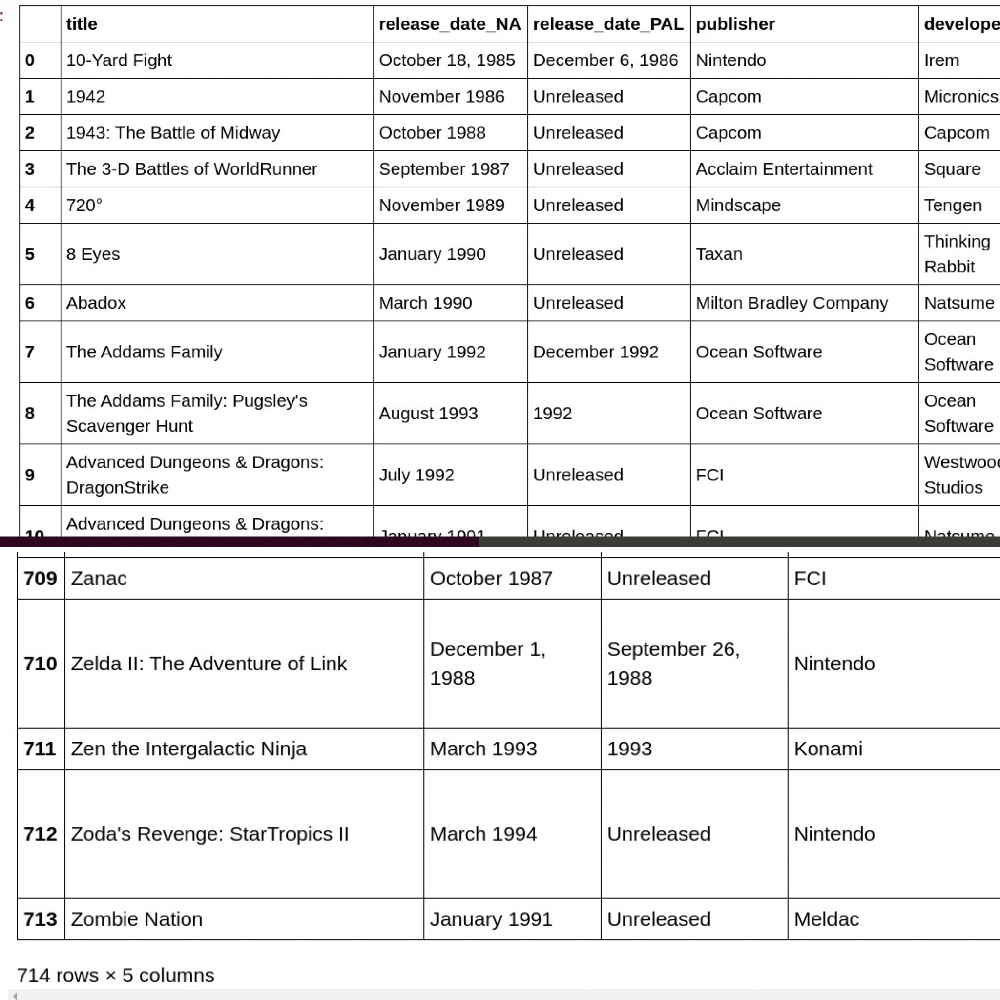

# Webscraping

**Project Content:**
Project involved webscraping of gaming data from Wikipedia using Pandas to manipulate the data and 
SQLite to create database of game data.  

**Image of organzied gaming data in spreadsheet:**

Data easily extracted from website

