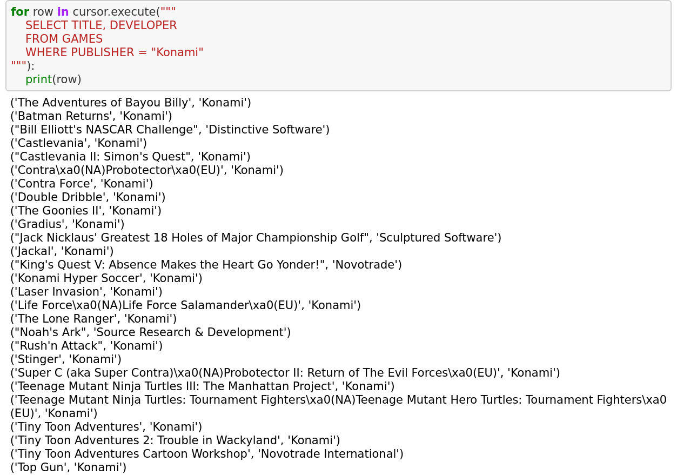

# Webscraping

**Project Content:**
Project involved webscraping of gaming data from Wikipedia using Pandas and SQL to manipulate data and create database of game information.  

**Image of organized gaming data in spreadsheet:**

Data easily extracted from website

**Image of data requested from SQL:**

